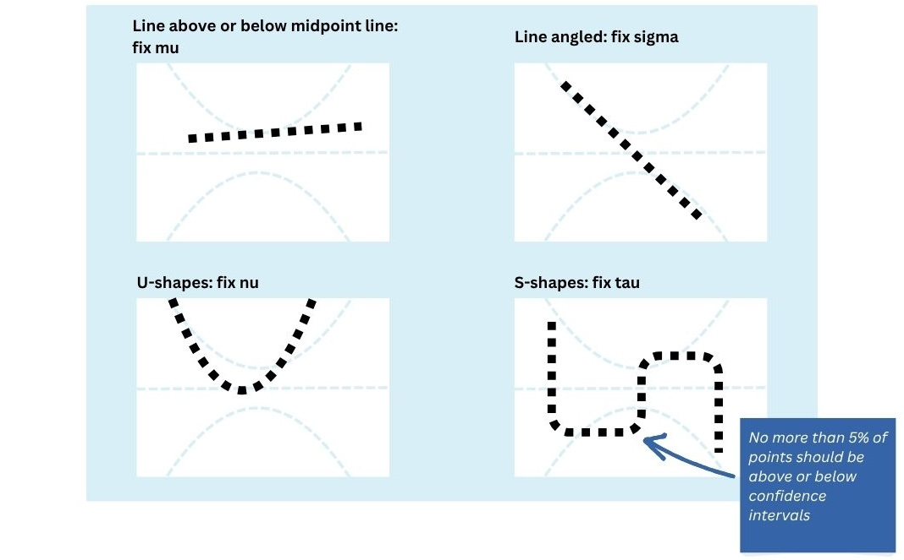

```{r, include = FALSE}
knitr::opts_chunk$set(
  collapse = TRUE,
  comment = "#>",
  message = FALSE,
  markup = FALSE,
  fig.width = 8,
  fig.height = 7
)

has_charts <- requireNamespace("gamlss2charts", quietly = TRUE)
```

```{r setup}
library(gamlssTools)
```

This vignette covers checking how well a model fits and getting centile/z-score values out of it.

We'll use this toy dataset:

```{r}
set.seed(1234)
n <- 1000

# Age sampled uniformly on the log scale (birth = 280 days post-conception)
logAge <- runif(n, log10(196), log10(280 + 100 * 365.25))  # 28wk gestation to 100y
df <- data.frame(
  Age    = round(10^logAge - 280),   # days post-birth
  logAge = logAge,
  Sex    = factor(sample(c("Female", "Male"), n, replace = TRUE))
)

# Study assignment correlated with age
study_center <- c(Study_A = 2.55, Study_B = 3.15, Study_C = 3.70,
                  Study_D = 4.15, Study_E = 4.45)
study_width  <- 0.5                       # larger = more overlap between studies
study_size   <- c(1, 1, 0.8, 1.3, 0.6)     # relative recruitment volume

w <- outer(df$logAge, study_center, dnorm, sd = study_width)
w <- sweep(w, 2, study_size, "*")
df$Study <- factor(colnames(w)[apply(w, 1, function(p) sample.int(length(p), 1, prob = p))],
                   levels = names(study_center))

# Median trajectory (arbitrary volume-like units): fast perinatal rise,
# childhood peak, gradual decline through adulthood
growth  <- plogis((df$logAge - 2.70) / 0.22)
atrophy <- 1 - 0.38 * plogis((df$logAge - 3.85) / 0.32)
mu <- 900 * growth * atrophy

# Sex: males ~10% larger, with a small age interaction
mu <- mu * ifelse(df$Sex == "Male", 1.10 * (1 + 0.04 * (df$logAge - 3.5)), 1)

# Study/scanner offsets
mu <- mu * c(Study_A = 1.00, Study_B = 0.92, Study_C = 1.10,
             Study_D = 0.96, Study_E = 1.06)[df$Study]

# Multiplicative noise, wider in infancy -> heteroscedastic and right-skewed
sigma <- 0.05 + 0.07 * plogis(-(df$logAge - 3.0) / 0.35)
df$Pheno <- mu * exp(rnorm(n, 0, sigma))
```

And fit a basic model
```{r}
pheno_model <- gamlss(formula = Pheno ~ pb(logAge) + Sex + random(Study), 
                      sigma.formula= ~ pb(logAge) + Sex, data = df, family=BCCG)
```

## Model Diagnostics

There are several quantitative and qualitative checks you'll likely want to perform on your models.

First, we can return BIC and AIC built-into the gamlss model object (note: will be different when using gamlss2 objects)

```{r}
pheno_model$sbc #BIC
pheno_model$aic #AIC
```

Lower BIC means a better fit model. We tend to use this over AIC.

Another helpful check is the worm plot. `wp.taki()` enhances the built-in `gamlss::wp()` by allowing you to break up plots along chunks of a continuous variable (like age) or by levels of a categorical variable (like sex), so you can make sure the model fits all groups well.

```{r}
#plot by age
wp.taki(xvar=df$logAge, resid=resid(pheno_model))

#plot by sex
df$Sex <- as.factor(df$Sex)
wp.taki(xvar=df$Sex, resid=resid(pheno_model))
```

Below is a quick illustrated reference for interpreting worm plots:
```{r, echo=FALSE, out.width="70%", fig.align="center"}

```

For more info, see:
Stasinopoulos, Dm & Rigby, Robert & Heller, Gillian & Voudouris, Vlasios & De Bastiani, Fernanda. (2017). Flexible regression and smoothing: Using GAMLSS in R. 10.1201/b21973. 

You can also check how well the predicted centiles for each point/subject line up with the percentiles themselves - that is, about 5% of subjects' centiles should be <= 0.05.

```{r}
centile_coverage(pheno_model, df)

#we can also view this by sex or age
centile_coverage(pheno_model, df, group="Sex")
centile_coverage(pheno_model, df, interval_var = "logAge", n=4)
```

Each of those calls re-scores every subject. If you've already calculated centiles (or scoring is
slow), hand them to `centile_coverage()` directly with the `centiles` argument instead of a model:

```{r}
df$centile <- score_centiles(pheno_model, df)

centile_coverage(data=df, centiles="centile", group="Sex")
```

## Calculating Reference Scores

Now let's say you want to get the centile values for each subject in your dataset or a new dataset.

We'll start by simulating a new, small dataset.
```{r}
set.seed(5678)
n_test <- 100

study_center_new <- c(Study_A = 2.55, Study_B = 3.15, Study_New = 4)
study_size_new   <- c(1, 1, 1)   # one weight per study above

test_logAge <- runif(n_test, log10(196), log10(280 + 100 * 365.25))
test_new <- data.frame(
  Age    = round(10^test_logAge - 280),
  logAge = test_logAge,
  Sex    = factor(sample(c("Female", "Male"), n_test, replace = TRUE)),
  # a clinical variable the model knows nothing about
  dx     = factor(sample(c("control", "case"), n_test, replace = TRUE),
                  levels = c("control", "case"))
)

w_test <- outer(test_new$logAge, study_center_new, dnorm, sd = study_width)
w_test <- sweep(w_test, 2, study_size_new, "*")
test_new$Study <- factor(colnames(w_test)[apply(w_test, 1, function(p) sample.int(length(p), 1, prob = p))],
                        levels = names(study_center_new))

test_mu <- 900 * plogis((test_new$logAge - 2.70) / 0.22) *
  (1 - 0.38 * plogis((test_new$logAge - 3.85) / 0.32))
test_mu <- test_mu * ifelse(test_new$Sex == "Male", 1.10 * (1 + 0.04 * (test_new$logAge - 3.5)), 1)
test_mu <- test_mu * c(Study_A = 1.00, Study_B = 0.92, Study_New = 0.89)[test_new$Study]

# add disease effect
test_mu <- test_mu * ifelse(test_new$dx == "case", 0.93, 1)

test_sigma <- 0.05 + 0.07 * plogis(-(test_new$logAge - 3.0) / 0.35)
test_new$Pheno <- test_mu * exp(rnorm(n_test, 0, test_sigma))

#for demo simplicity, we'll save a couple subsets
test_control <- test_new %>% filter(dx=="control")
test_df <- test_control %>% filter(Study != "Study_New")
```

Now we can return the centile values for each subject, as estimated by our model above.

```{r}
test_df$centile <- score_centiles(pheno_model, test_df)
range(test_df$centile)
```

You can check the centile score's coverage (i.e., are 10% of subjects in the 10th percentile or less?) using `centile_coverage()`

```{r}
centile_coverage(data=test_df, centiles="centile", group="Study")
```

You can also return standardized scores, or "pseudo-z-scores"

```{r}
score_centiles(pheno_model, test_df, standardize=TRUE)
```

The same code will work to calculate centiles for the original data the model was fit on.

However, this training data isn't necessary for running `score_centiles()` on new data, which is useful when the model is saved and reloaded and/or when the training data can't be shared.

### Out-of-Sample Centile Scoring

We can also get scores for data from a new site ('Site_New') that wasn't part of the training data our model was fit on.

```{r}
table(test_control$Study)
```

Out-of-sample scoring is handled by the optional dependency, gamlss2charts, which you can install
with `remotes::install_github("andy1764/gamlss2charts@dev")`. Everything above works without it;
only the `batch_term` and `ref_data` chunks below need it.

```{r, echo = FALSE, results = "asis", eval = !has_charts}
cat("> **gamlss2charts is not installed**, so the remaining chunks are shown but not run.\n",
    "> Install it with `remotes::install_github(\"andy1764/gamlss2charts@dev\")` and rebuild\n",
    "> this vignette to see their output.\n", sep = "")
```

If we just stick with the defaults, site effects for our new site will be set to 0, which doesn't produce very good estimates.

```{r}
test_control$centile <- score_centiles(pheno_model, test_control)
centile_coverage(data=test_control, centiles="centile", group="Study")
```

Passing the `batch_term` arg enables batch-effect estimation and removal via `gamlss2charts::predict_score()`

```{r, eval = has_charts}
#get centiles 
test_control$centile2 <- score_centiles(pheno_model, test_control, batch_term="Study")
hist(test_control$centile2)

#check how they look
centile_coverage(data=test_control, centiles="centile2", group="Study")
```

Much better!

We can even specify a subset of the data to be used as a reference, from which batch effects are calculated.
For example, while you may assume that the controls for your new site should have centiles that are evenly distributed across the range of 0-1. However, this may not be the case with individuals who have psychopatholgy, who may have deviations you want to preserve in their centile scores.

```{r}
table(test_new$Study, test_new$dx)
```

You can use your controls to estimate and remove site effects from new batches by using the `ref_data` argument, 
which accepts a formula/character string defining how reference data should be subsetted from your `data`...

```{r, eval = has_charts}
test_new$centile <- score_centiles(pheno_model, test_new, batch_term="Study", ref_data= ~ dx=="control")

ggplot(test_new) +
  geom_histogram(aes(x=centile, fill=dx), position="dodge", alpha=.6) +
  theme_minimal()
```

... Or an entirely new dataframe, which will just be used to calculate batch effects for `data` but not
scored itself (unless these subjects are also part of your `data` input)

```{r, eval = has_charts}
score_centiles(pheno_model, test_new, batch_term="Study", ref_data=test_control)
```

How many data points do you need to calculate batch effects? Current testing suggests you need about *75 reference subjects per batch* for good (mean error ~ 1 centile) out-of-sample estimates. You can set `score_centiles()` to automatically return `NA` for any batches that are below a specified threshold and therefore unlikely to be reliable.

```{r, eval = has_charts}
test_control %>%
  filter(Study == "Study_New") %>%
  nrow()

# min_ref < N: all data is scored
test_new$centile_min10 <- score_centiles(pheno_model, test_new, batch_term="Study", ref_data=test_control, min_ref = 10)

# min_ref > N: return NA for small batches
test_new$centile_min25 <- score_centiles(pheno_model, test_new, batch_term="Study", ref_data=test_control, min_ref = 25)

sum(is.na(test_new$centile_min10))
sum(is.na(test_new$centile_min25))

#number of unscored centiles = sample size for Study_New
sum(is.na(test_new$centile_min25)) == sum(test_new$Study == "Study_New")
```

### Comparing Reference Scores

It can also be useful to compare the reference scores estimated by two different models on the same dependent variable. For instance, maybe you want to see the practical implications of using different coefficients and how they impact the z-scores predicted to a dataset. 
Alternatively, maybe you're sharing a modified version of your model with collaborators (see `sanitize_gamlss.R`) and want to confirm that nothing in the output has changed.

To do this, you can use `compare_scores()`, which can compare models on two different outputs:
* the z-scores estimated for each row in a dataframe (`data`)
* the y-values of the estimated centile lines (as fit across each level of `sim_grid_list`)

```{r}
#fit a new model with different splines
pheno_model2 <- gamlss(formula = Pheno ~ cs(logAge) + Sex + random(Study), 
                      sigma.formula= ~ cs(logAge) + Sex, data = df, family=BCCG)

#compare z-scores
#note - need to supply the fit data for pheno_model2 since it contains cs()
compare_scores(pheno_model, pheno_model2, data=df, fit_data2 = df) 

#compare centile lines
sim_list <- sim_grid(df, "logAge", "Study")
compare_scores(pheno_model, pheno_model2, sim_grid_list = sim_list, fit_data2 = df) 
```

You can also run both comparisons (z-scores and predicted y for each centile line) simultaneously. The function is set up to check for matching outputs, i.e. no differences between the two models. The default tolerance for "no" differences is 1e-6, or 1 millionth of y's standard deviation.